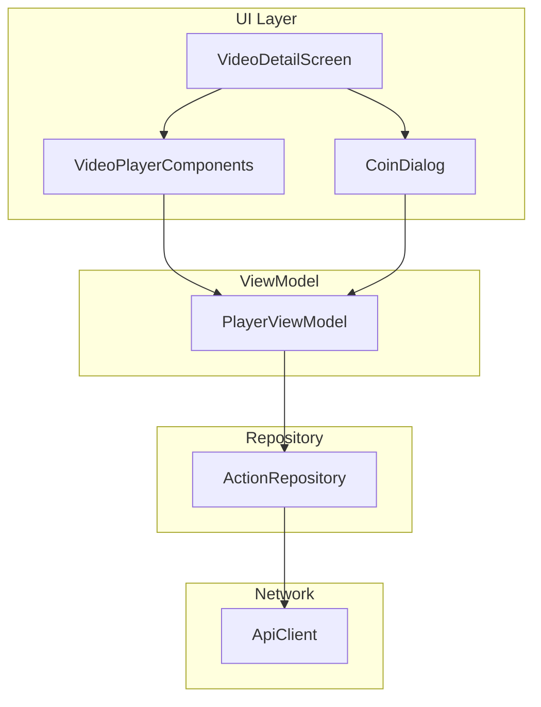
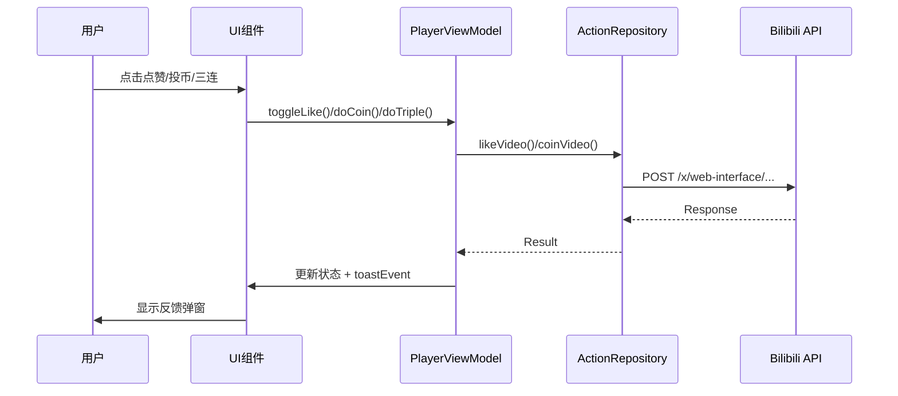

# 视频详情页功能增强 - 设计文档

## 概述

本设计文档描述了视频详情页功能增强的技术实现方案，包括视频简介展示、点赞、投币和一键三连功能。设计基于已有的 `ActionRepository` 和 `PlayerViewModel` 架构进行扩展。

---

## 架构设计

### 组件关系图



### 数据流



---

## API 接口设计

### 1. 点赞接口

| 项目 | 值 |
|------|-----|
| **端点** | `POST x/web-interface/archive/like` |
| **认证** | Cookie (SESSDATA) + CSRF Token |

**请求参数**:

```kotlin
@FormUrlEncoded
@POST("x/web-interface/archive/like")
suspend fun likeVideo(
    @Field("aid") aid: Long,
    @Field("like") like: Int,      // 1=点赞, 2=取消点赞
    @Field("csrf") csrf: String
): SimpleApiResponse
```

### 2. 查询点赞状态

| 项目 | 值 |
|------|-----|
| **端点** | `GET x/web-interface/archive/has/like` |
| **认证** | Cookie (SESSDATA) |

**请求参数**:

```kotlin
@GET("x/web-interface/archive/has/like")
suspend fun hasLiked(
    @Query("aid") aid: Long
): HasLikedResponse  // data: 0=未点赞, 1=已点赞
```

### 3. 投币接口

| 项目 | 值 |
|------|-----|
| **端点** | `POST x/web-interface/coin/add` |
| **认证** | Cookie (SESSDATA) + CSRF Token |

**请求参数**:

```kotlin
@FormUrlEncoded
@POST("x/web-interface/coin/add")
suspend fun coinVideo(
    @Field("aid") aid: Long,
    @Field("multiply") multiply: Int,     // 投币数量 1 或 2
    @Field("select_like") selectLike: Int, // 1=同时点赞, 0=不点赞
    @Field("csrf") csrf: String
): SimpleApiResponse
```

**错误码**:

- `34004`: 投币间隔太短
- `34005`: 投币数量超限

### 4. 查询投币状态

| 项目 | 值 |
|------|-----|
| **端点** | `GET x/web-interface/archive/coins` |
| **认证** | Cookie (SESSDATA) |

**请求参数**:

```kotlin
@GET("x/web-interface/archive/coins")
suspend fun hasCoined(
    @Query("aid") aid: Long
): HasCoinedResponse  // data.multiply: 已投币数量
```

---

## 组件和接口设计

### 1. ActionRepository 扩展

```kotlin
object ActionRepository {
    // 已有方法
    suspend fun followUser(mid: Long, follow: Boolean): Result<Boolean>
    suspend fun favoriteVideo(aid: Long, favorite: Boolean): Result<Boolean>
    suspend fun checkFollowStatus(mid: Long): Boolean
    suspend fun checkFavoriteStatus(aid: Long): Boolean
    
    // 新增方法
    suspend fun likeVideo(aid: Long, like: Boolean): Result<Boolean>
    suspend fun checkLikeStatus(aid: Long): Boolean
    suspend fun coinVideo(aid: Long, count: Int, alsoLike: Boolean): Result<Boolean>
    suspend fun checkCoinStatus(aid: Long): Int  // 返回已投币数
    suspend fun tripleAction(aid: Long): Result<TripleResult>
}

data class TripleResult(
    val likeSuccess: Boolean,
    val coinSuccess: Boolean,
    val coinMessage: String?,      // 投币失败原因
    val favoriteSuccess: Boolean
)
```

### 2. PlayerUiState 扩展

```kotlin
data class Success(
    // 已有字段...
    val isFollowing: Boolean = false,
    val isFavorited: Boolean = false,
    
    // 新增字段
    val isLiked: Boolean = false,
    val coinCount: Int = 0,        // 用户已投币数 (0/1/2)
    val userCoinBalance: Int = 0,  // 用户硬币余额 (可选)
)
```

### 3. PlayerViewModel 扩展

```kotlin
class PlayerViewModel {
    // 新增方法
    fun toggleLike()              // 切换点赞状态
    fun openCoinDialog()          // 打开投币对话框
    fun doCoin(count: Int, alsoLike: Boolean)  // 执行投币
    fun doTripleAction()          // 一键三连
    
    // 投币对话框状态
    private val _coinDialogVisible = MutableStateFlow(false)
    val coinDialogVisible: StateFlow<Boolean>
}
```

### 4. UI 组件

#### ActionButtonsRow 更新

- 点赞按钮：显示点赞数，支持点击切换
- 投币按钮：显示投币数，点击打开投币选择
- 新增三连按钮：显示三连图标

#### CoinDialog 新组件

```kotlin
@Composable
fun CoinDialog(
    visible: Boolean,
    userCoinCount: Int,      // 用户已投币数 (0/1/2)
    onDismiss: () -> Unit,
    onConfirm: (count: Int, alsoLike: Boolean) -> Unit
)
```

---

## 数据模型

### 新增 Response 模型

```kotlin
@Serializable
data class HasLikedResponse(
    val code: Int = 0,
    val message: String = "",
    val data: Int = 0       // 0=未点赞, 1=已点赞
)

@Serializable
data class HasCoinedResponse(
    val code: Int = 0,
    val message: String = "",
    val data: CoinData? = null
)

@Serializable
data class CoinData(
    val multiply: Int = 0   // 已投币数量
)
```

---

## 错误处理

| 错误场景 | 处理方式 |
|---------|---------|
| 用户未登录 | 显示"请先登录"弹窗 |
| CSRF Token 为空 | 显示"请先登录"弹窗 |
| 网络请求失败 | 显示"网络错误，请重试" |
| 投币余额不足 | 显示"硬币余额不足" |
| 投币间隔太短 (34004) | 显示"操作太频繁，请稍后重试" |
| 投币超限 (34005) | 显示"已投满2个硬币" |
| 视频不可用 | 显示"视频不可用" |

---

## 测试策略

### 单元测试

1. `ActionRepository` 各方法返回值测试
2. `PlayerViewModel` 状态更新逻辑测试
3. 三连操作部分失败场景测试

### 集成测试

1. API 请求参数正确性验证
2. 错误码处理验证

### UI 测试

1. 按钮状态切换正确性
2. 投币对话框交互流程
3. 弹窗显示与消失

---

## 设计决策

1. **复用现有架构**：扩展 `ActionRepository` 而非创建新 Repository，保持代码一致性
2. **状态集中管理**：所有操作状态存储在 `PlayerUiState.Success` 中，便于 UI 同步
3. **乐观更新**：点赞等操作先更新 UI 状态，失败后回滚
4. **投币使用对话框**：投币需要选择数量，使用 Dialog 而非直接操作
5. **三连容错**：部分失败不阻断整体，完成后统一反馈结果
