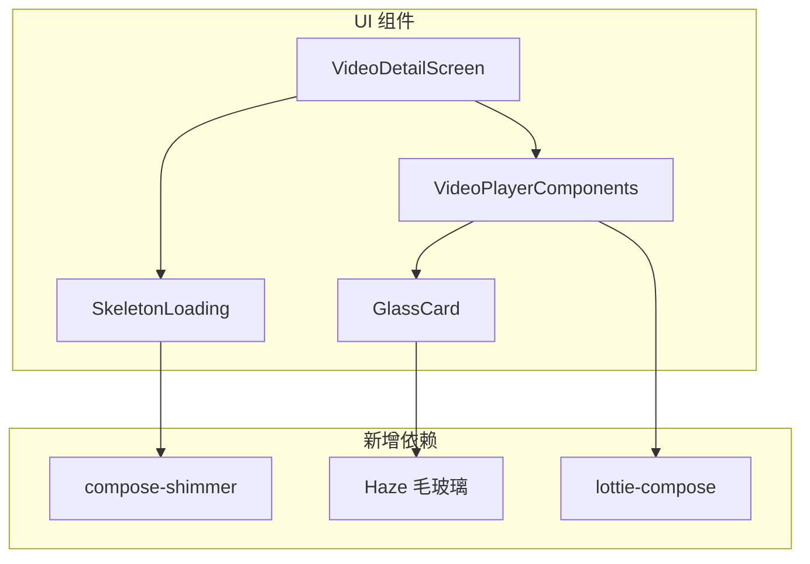

# 视频详情页 UI 重构 - 设计文档

## 概述

采用 iOS/Cupertino 设计语言重构视频详情页，集成 Compose Cupertino、Haze 毛玻璃效果、Lottie 动画等开源库，打造精美的类 iOS 风格界面。

---

## 架构设计

### 依赖关系图



---

## 组件设计

### 1. 依赖配置

```kotlin
// build.gradle.kts
dependencies {
    // 毛玻璃效果
    implementation("dev.chrisbanes.haze:haze:0.7.3")
    implementation("dev.chrisbanes.haze:haze-materials:0.7.3")
    
    // Shimmer 骨架屏
    implementation("com.valentinilk.shimmer:compose-shimmer:1.2.0")
    
    // Lottie 动画
    implementation("com.airbnb.android:lottie-compose:6.3.0")
}
```

### 2. 骨架屏加载组件

```kotlin
@Composable
fun VideoDetailSkeleton() {
    // 视频播放器占位
    // UP主信息骨架
    // 操作按钮骨架
    // 推荐视频列表骨架
}
```

**设计要点**：

- Shimmer 动画从左到右流动
- 使用圆角矩形模拟真实布局
- 加载完成后平滑过渡

### 3. 毛玻璃卡片组件

```kotlin
@Composable
fun GlassCard(
    modifier: Modifier,
    blurRadius: Dp = 20.dp,
    content: @Composable () -> Unit
) {
    // 使用 Haze 实现磨砂效果
    // 半透明白色背景
    // 细边框增强层次
}
```

**设计要点**：

- `blurRadius` 控制模糊程度
- 背景色：`Color.White.copy(alpha = 0.15f)`
- 边框：1dp 半透明白色

### 4. iOS 风格操作按钮

```kotlin
@Composable
fun IOSActionButton(
    icon: ImageVector,
    label: String,
    isActive: Boolean,
    activeColor: Color,
    onClick: () -> Unit
) {
    // SF Symbols 风格图标
    // 点击时弹性缩放动画
    // 状态切换渐变过渡
}
```

**动效设计**：

- 按下：缩小至 0.9 倍
- 释放：弹性回弹至 1.0 倍
- 状态切换：300ms 渐变

### 5. Lottie 庆祝动画

| 动画场景 | 动画文件 | 触发时机 |
|---------|---------|---------|
| 点赞成功 | `like_burst.json` | 切换为已点赞 |
| 投币成功 | `coin_drop.json` | 投币完成 |
| 三连成功 | `triple_celebrate.json` | 三连全部成功 |

> 可从 [LottieFiles](https://lottiefiles.com) 下载免费动画

---

## UI 改造清单

### 阶段 1：基础设施（必须）

| 组件 | 改造内容 | 优先级 |
|------|---------|-------|
| build.gradle | 添加 Haze、Shimmer、Lottie 依赖 | P0 |
| SkeletonLoading | 创建骨架屏组件 | P0 |
| VideoDetailScreen | 集成骨架屏 | P0 |

### 阶段 2：视觉升级

| 组件 | 改造内容 | 优先级 |
|------|---------|-------|
| GlassCard | 创建毛玻璃卡片组件 | P1 |
| ActionButtonsRow | 重构为 iOS 风格 | P1 |
| VideoHeaderSection | 添加毛玻璃效果 | P1 |

### 阶段 3：动效增强

| 组件 | 改造内容 | 优先级 |
|------|---------|-------|
| 点赞按钮 | Lottie 爆裂动画 | P2 |
| 投币按钮 | Lottie 金币动画 | P2 |
| 视频卡片 | Hover/Press 动效 | P2 |

---

## 视觉规范

### 颜色

| 用途 | 颜色值 | 说明 |
|------|-------|------|
| 毛玻璃背景 | `rgba(255,255,255,0.15)` | 深色模式下 |
| 毛玻璃边框 | `rgba(255,255,255,0.2)` | 细边框 |
| 点赞激活色 | `#FF2D55` | iOS 粉色 |
| 投币激活色 | `#FFD60A` | iOS 金色 |
| 收藏激活色 | `#FF9500` | iOS 橙色 |

### 圆角

| 元素 | 圆角 |
|------|------|
| 大卡片 | 20dp |
| 按钮 | 12dp |
| 视频封面 | 12dp |
| 小标签 | 6dp |

### 动效时长

| 动效类型 | 时长 |
|---------|------|
| 按钮按压 | 100ms |
| 状态切换 | 300ms |
| 骨架屏闪烁 | 1000ms |
| Lottie 动画 | 跟随动画文件 |

---

## 测试策略

### 视觉测试

- 深色/浅色模式下毛玻璃效果
- 不同屏幕尺寸布局适配

### 性能测试

- 骨架屏动画流畅度 (60fps)
- Lottie 动画内存占用
- 毛玻璃效果 GPU 负载

---

## 设计决策

1. **选择 Haze 而非 Modifier.blur()**：Haze 支持更低 Android 版本，效果更可控
2. **骨架屏优先**：提升感知加载速度，改善用户体验
3. **渐进式改造**：分阶段实施，每阶段可独立测试验证
4. **Lottie 动画可选**：作为 P2 优先级，不影响核心功能
