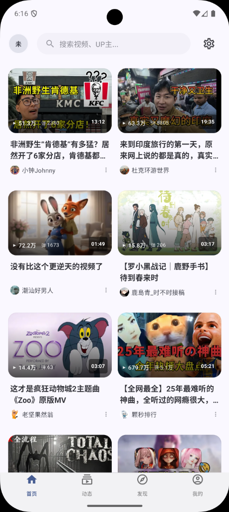
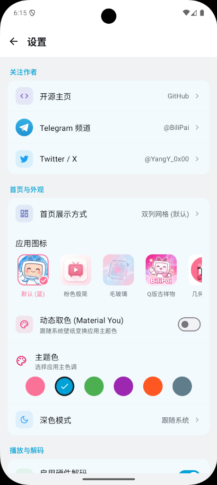

# BiliPai ( ゜- ゜)つロ 干杯~

[](https://t.me/BiliPai)
[](https://x.com/YangY_0x00)

<p align="center">
  
  
  
  
  
  
</p>

> **"Cheers to the Pure View."**  ✨
>
> BiliPai 是一款现代化的 Bilibili 第三方 Android 客户端，基于 **Jetpack Compose** 和 **Material Design 3** 构建。
> 我们专注于提供纯粹、流畅、无广告的视频观看体验。

---

## 📸 应用预览

<!-- 
🖼️ 截图建议：
1. 首页推荐流 (浅色主题) - 展示瀑布流布局和视频卡片
2. 首页推荐流 (深色主题) - 展示深色模式适配
3. 视频播放页 - 展示播放器、弹幕、清晰度按钮
4. 全屏播放 (横屏) - 展示弹幕效果和控制栏
5. 画中画模式 - 小窗播放效果
6. 搜索页面 - 搜索发现、热门搜索、历史记录
7. 设置页面 - 展示个性化选项
8. 登录页面 - 扫码登录界面
-->

<p align="center">
  
  
  
</p>

<p align="center">
  
  
</p>

---

## ✨ 核心特性

### 🎬 视频播放

| 功能 | 描述 |
|------|------|
| **高清画质** | 支持 4K、1080P60、HDR 等高清画质 (需登录/大会员) |
| **DASH 流媒体** | 现代化视频格式，自适应码率切换 |
| **弹幕系统** | 基于 DanmakuFlameMaster，支持透明度、字体、速度调节 |
| **手势控制** | 左滑亮度、右滑音量、横滑进度 (支持灵敏度调节) |
| **倍速播放** | 0.5x ~ 2.0x 倍速切换 |
| **画中画** | 悬浮小窗播放，多任务无缝切换 |

### 📺 番剧追番

| 功能 | 描述 |
|------|------|
| **番剧首页** | 热门推荐、新番时间表、分类浏览 |
| **番剧详情** | 评分、简介、相关季度、追番功能 |
| **官方风格选集** | 底部弹出面板、季度切换、分页选择、跳转功能 |
| **番剧播放** | 支持弹幕、手势控制、自动下一集 |

### 📡 直播功能

| 功能 | 描述 |
|------|------|
| **直播首页** | 热门直播、分区列表 |
| **直播播放** | HLS 流媒体、清晰度切换、弹幕显示 |

### 🎨 现代化 UI

| 功能 | 描述 |
|------|------|
| **Material You** | 完整支持 Material Design 3，动态主题色 |
| **iOS 风格底栏** | 毛玻璃效果、动态取色、滑动切换 |
| **深色模式** | 完美适配系统深色/浅色主题 |
| **Lottie 动画** | 点赞、投币、收藏等丝滑反馈动画 |
| **骨架屏** | Shimmer 效果的优雅加载占位 |
| **彩色互动栏** | 点赞(粉)、投币(金)、收藏(黄)、三连(红)、评论(青) |

### 🔍 智能搜索

| 功能 | 描述 |
|------|------|
| **搜索发现** | 基于历史记录的个性化推荐 + 热门推荐兜底 |
| **实时联想** | 输入时即时显示搜索建议 (300ms 防抖) |
| **热门搜索** | B 站实时热搜榜单 |
| **搜索历史** | 本地历史记录，自动去重 |

### 📱 核心功能

- **首页推荐**：高性能瀑布流，智能预加载，无限滚动
- **视频详情**：完整的视频信息、UP主信息、相关推荐
- **评论系统**：支持楼中楼回复、表情解析
- **动态页面**：关注 UP 主的动态流
- **分区浏览**：全站分区视频浏览

### 🔐 账户功能

- **扫码登录**：官方 TV 端扫码 API
- **网页登录**：WebView 备选方案
- **大会员识别**：VIP 标识与专属画质权限

---

## 🛠 技术架构

```
┌─────────────────────────────────────────────────────────┐
│                    Presentation Layer                    │
│  ┌─────────────┐  ┌─────────────┐  ┌─────────────┐     │
│  │   Screens   │  │  ViewModels │  │   Compose   │     │
│  │  (Compose)  │  │   (State)   │  │    Theme    │     │
│  └─────────────┘  └─────────────┘  └─────────────┘     │
├─────────────────────────────────────────────────────────┤
│                      Domain Layer                        │
│  ┌─────────────────────────────────────────────────┐   │
│  │              Repository Pattern                  │   │
│  └─────────────────────────────────────────────────┘   │
├─────────────────────────────────────────────────────────┤
│                       Data Layer                         │
│  ┌──────────┐  ┌──────────┐  ┌──────────┐  ┌────────┐ │
│  │ Retrofit │  │   Room   │  │DataStore │  │ExoPlayer│ │
│  │  (API)   │  │   (DB)   │  │(Settings)│  │ (Video) │ │
│  └──────────┘  └──────────┘  └──────────┘  └────────┘ │
└─────────────────────────────────────────────────────────┘
```

### 技术栈详情

| 类别 | 技术 |
|------|------|
| **语言** | Kotlin 1.9+ |
| **UI 框架** | Jetpack Compose (Material3) |
| **架构模式** | MVVM + Clean Architecture |
| **依赖注入** | Manual DI (Repository Pattern) |
| **网络请求** | Retrofit + OkHttp + Kotlinx Serialization |
| **图片加载** | Coil Compose |
| **视频播放** | ExoPlayer (Media3) + DASH + HLS |
| **弹幕引擎** | DanmakuFlameMaster + ByteDance DanmakuRenderEngine |
| **动画库** | Lottie Compose |
| **本地存储** | Room (历史记录) + DataStore (设置) |
| **异步处理** | Kotlin Coroutines + Flow |
| **导航** | Jetpack Navigation Compose |
| **毛玻璃效果** | Haze |
| **代码压缩** | R8 Proguard (APK 仅 14MB) |

---

## 📦 安装使用

### 下载安装

前往 [Releases](https://github.com/jay3-yy/BiliPai/releases) 页面下载最新版本 APK。

> **注意**: 当前仅提供 **arm64-v8a** (64位) 版本，支持绝大多数现代 Android 手机。

### 系统要求

- Android 10.0 (API 29) 及以上
- 推荐 Android 12+ 以获得完整 Material You 体验
- 64 位处理器 (arm64-v8a)

### 从源码构建

```bash
# 克隆仓库
git clone https://github.com/jay3-yy/BiliPai.git

# 进入目录
cd BiliPai

# 构建 Release 版本 (启用 R8 压缩)
./gradlew assembleRelease

# APK 位置
# app/build/outputs/apk/release/app-release.apk
```

---

## 🗺️ 开发路线图

### ✅ 已完成

- [x] 首页推荐流 (瀑布流 + 无限滚动)
- [x] 视频播放 (DASH + 手势控制)
- [x] 弹幕系统 (显示 + 设置调节)
- [x] 高清画质支持 (4K/1080P60/HDR)
- [x] 扫码/网页登录
- [x] 评论系统 (楼中楼)
- [x] 动态页面
- [x] 搜索功能 (联想 + 热搜 + 历史)
- [x] 画中画模式
- [x] 倍速播放
- [x] Material You 主题
- [x] 深色模式
- [x] **番剧功能** (详情、追番、播放)
- [x] **直播功能** (HLS 流媒体)
- [x] **官方风格选集面板** (底部弹出、季度切换、分页)
- [x] **iOS 风格 UI** (毛玻璃底栏、动态取色)
- [x] **APK 体积优化** (R8 压缩，仅 14MB)

### 🚧 进行中

- [ ] 弹幕发送功能
- [ ] 离线缓存 (视频下载)

### 📋 计划中

- [ ] 平板/折叠屏适配
- [ ] 观看历史云同步
- [ ] 投稿功能

---

## 🙏 致谢

感谢以下优秀的开源项目：

| 项目 | 用途 |
|------|------|
| [Jetpack Compose](https://developer.android.com/jetpack/compose) | 现代化声明式 UI 框架 |
| [Media3 ExoPlayer](https://github.com/androidx/media) | 强大的媒体播放器 |
| [DanmakuFlameMaster](https://github.com/bilibili/DanmakuFlameMaster) | Bilibili 官方弹幕引擎 |
| [Retrofit](https://github.com/square/retrofit) | 类型安全的 HTTP 客户端 |
| [Coil](https://github.com/coil-kt/coil) | Kotlin 优先的图片加载库 |
| [Lottie](https://github.com/airbnb/lottie-android) | 精美的矢量动画 |
| [Haze](https://github.com/chrisbanes/haze) | Compose 毛玻璃效果 |
| [bilibili-API-collect](https://github.com/SocialSisterYi/bilibili-API-collect) | B 站 API 文档整理 |

---

## 🤝 贡献指南

欢迎各种形式的贡献！

1. **Fork** 本仓库
2. 创建特性分支 (`git checkout -b feature/amazing-feature`)
3. 提交更改 (`git commit -m 'feat: add amazing feature'`)
4. 推送到分支 (`git push origin feature/amazing-feature`)
5. 提交 **Pull Request**

### 提交规范

- `feat:` 新功能
- `fix:` 修复 Bug
- `docs:` 文档更新
- `style:` 代码格式
- `refactor:` 重构
- `perf:` 性能优化
- `chore:` 构建/工具

---

## ⭐ Star History

<a href="https://star-history.com/#jay3-yy/BiliPai&Date">
 <picture>
   <source media="(prefers-color-scheme: dark)" srcset="https://api.star-history.com/svg?repos=jay3-yy/BiliPai&type=Date&theme=dark" />
   <source media="(prefers-color-scheme: light)" srcset="https://api.star-history.com/svg?repos=jay3-yy/BiliPai&type=Date" />
   
 </picture>
</a>

---

## 📄 许可证

本项目基于 [GPL-3.0 License](LICENSE) 开源。

---

## ⚠️ 免责声明

> [!CAUTION]
>
> 1. 本项目仅供 **学习交流** 使用，**严禁用于商业用途**
> 2. 所有数据来源于 Bilibili 官方 API，版权归上海幻电信息科技有限公司所有
> 3. 本项目不存储任何用户隐私数据，登录信息仅保存在本地
> 4. 如涉及版权问题，请联系作者删除

---

<p align="center">
  Made with ❤️ by <a href="https://x.com/YangY_0x00">YangY</a>
  <br>
  <sub>( ゜- ゜)つロ 干杯~</sub>
</p>
