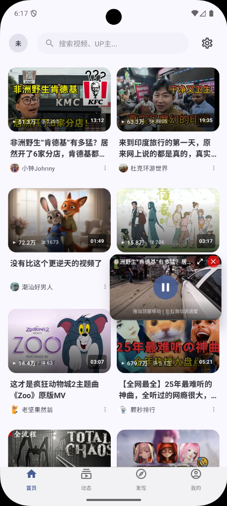
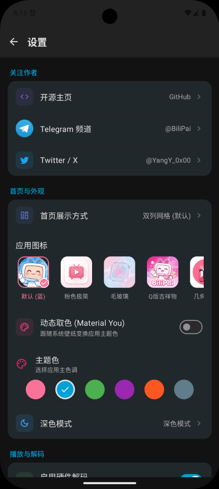

# BiliPai ( ゜- ゜)つロ 干杯~

  
  
  
  

> **"Cheers to the Pure View."**
> 
> BiliPai 是一个基于 **Jetpack Compose** 和 **Material Design 3** 构建的现代化 Bilibili 第三方客户端。
> 我们剔除了所有繁杂的营销功能，只保留最纯粹的视频观看体验。

---

## 📸 预览 Preview

  
  
  

  
  
  

---

## ✨ 核心特性

### 🎨 现代化 UI
- **Material Design 3** 设计规范，支持动态取色
- **Lottie 动画**：加载、点赞、收藏等丝滑动画效果
- **骨架屏加载**：Shimmer 效果的占位加载
- **彩色按钮栏**：点赞(粉)、投币(金)、收藏(黄)、分享(蓝)、评论(青)

### 📱 核心功能
- **首页推荐**：高性能瀑布流，下拉刷新，无限加载
- **视频播放**：基于 ExoPlayer，支持手势控制（亮度/音量/进度）
- **1080P+ 画质**：DASH 格式支持，大会员可切换更高画质
- **评论系统**：支持楼中楼回复查看
- **动态页面**：关注 UP 主的动态流
- **搜索功能**：热搜、历史记录、搜索建议

### 🔐 账户功能
- **扫码登录**：官方 API 扫码登录
- **网页登录**：WebView 备选登录方式
- **VIP 状态检测**：大会员标识与专属画质

### 🌗 个性化
- **深色/浅色主题**：完美适配系统主题
- **画中画模式**：悬浮窗播放
- **播放统计**：实时显示分辨率和码率

---

## 🛠 技术栈

| 类别 | 技术 |
|------|------|
| **语言** | Kotlin |
| **UI** | Jetpack Compose (Material3) |
| **架构** | MVVM + Repository |
| **网络** | Retrofit + OkHttp + Kotlinx Serialization |
| **图片** | Coil |
| **视频** | ExoPlayer (DASH) |
| **动画** | Lottie Compose |
| **异步** | Coroutines + Flow |
| **导航** | Jetpack Navigation Compose |

---

## 🗺️ 开发路线图

### ✅ 已完成
- [x] 首页推荐流
- [x] 视频播放 (DASH 格式)
- [x] 1080P 及以上画质支持
- [x] 扫码/网页登录
- [x] 评论系统
- [x] 动态页面
- [x] 搜索功能
- [x] 现代化 UI 组件 (Lottie + Shimmer)

### � 进行中
- [ ] 弹幕系统
- [ ] 视频发布时间/分区显示

### 📋 计划中
- [ ] 番剧支持
- [ ] 直播功能
- [ ] 离线缓存
- [ ] 平板适配

---

## 🙏 致谢

感谢以下优秀的开源项目：

| 项目 | 用途 |
|------|------|
| [Jetpack Compose](https://developer.android.com/jetpack/compose) | 现代化声明式 UI 框架 |
| [ExoPlayer](https://github.com/google/ExoPlayer) | 强大的视频播放器 |
| [Retrofit](https://github.com/square/retrofit) | 类型安全的 HTTP 客户端 |
| [OkHttp](https://github.com/square/okhttp) | 高效的网络请求库 |
| [Coil](https://github.com/coil-kt/coil) | Kotlin 优先的图片加载库 |
| [Lottie](https://github.com/airbnb/lottie-android) | 精美的动画效果 |
| [bilibili-API-collect](https://github.com/SocialSisterYi/bilibili-API-collect) | B 站 API 文档整理 |

---

## 🤝 贡献

欢迎各种形式的贡献！

1. Fork 本仓库
2. 新建分支 (`git checkout -b feature/AmazingFeature`)
3. 提交更改 (`git commit -m 'Add AmazingFeature'`)
4. 推送 (`git push origin feature/AmazingFeature`)
5. 提交 Pull Request

---

## ⭐ Star History

<a href="https://star-history.com/#jay3-yy/BiliPai&Date">
 <picture>
   <source media="(prefers-color-scheme: dark)" srcset="https://api.star-history.com/svg?repos=jay3-yy/BiliPai&type=Date&theme=dark" />
   <source media="(prefers-color-scheme: light)" srcset="https://api.star-history.com/svg?repos=jay3-yy/BiliPai&type=Date" />
   
 </picture>
</a>

---

## 📄 许可证

本项目基于 [GPL-3.0 License](LICENSE) 开源。

---

## ⚠️ 免责声明

1. 本项目仅供 **学习交流** 使用
2. **严禁用于商业用途**
3. API 来源于 Bilibili 官方，数据版权归上海幻电信息科技有限公司所有
4. 如侵犯您的权益，请联系作者删除

---

  Made with ❤️ by YangY 
   
  ( ゜- ゜)つロ 干杯~

